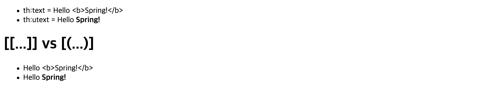

# thymeleaf
Java Template Engine Library

***

### (#01) Escape vs UnEscaped
HTML 문서는 ``<``, ``>`` 같은 특수문자를 기반으로 정의된다.
따라서 뷰 템플릿으로 HTML 화면을 생성할 때는 출력하는 데이터에 이러한 특수 문자가 있는 것을 주의해서 사용해야 한다.

```java
model.addAttribute("data", "Hello Spring!");
```

```java
model.addAttribute("data", "<b>Hello Spring!</b>");
```

* 변경 전 : Hello Spring!
* 변경 후 : Hello ``<b>``Spring!``</b>``

Escape 때문에 ``<b>`` 태그가 적용되지 않는 모습이다. 따라서 타임리프에서 ``<b>`` 태그를
적용시키려면 아래의 2가지 기능을 사용해야 한다.

* ``th:text`` -> ``th:utext``
* ``[[${data}]]`` -> ``[(${data)]``

### 적용
```html
<!DOCTYPE html>
<html lang="en">
<head>
    <meta charset="UTF-8">
    <title>Title</title>
</head>
<body>
<ul>
    <li>th:text = <span th:text = "${data}"></span></li>
    <li>th:text = <span th:utext = "${data}"></span></li>
</ul>

<h1><span th:inline="none">[[...]] vs [(...)]</span></h1>
<ul>
    <li><span th:inline = "none"></span>[[${data}]]</li>
    <li><span th:inline = "none"></span>[(${data})]</li>
</ul>
</body>
</html>
```

***
