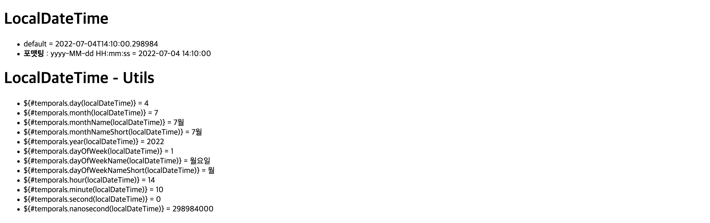

# thymeleaf
> Java Template Engine Library

***
<details>
<summary>(#01) Escape vs UnEscaped</summary>
<div markdown="1">

## (#01) Escape vs UnEscaped
HTML 문서는 ``<``, ``>`` 같은 특수문자를 기반으로 정의된다.
따라서 뷰 템플릿으로 HTML 화면을 생성할 때는 출력하는 데이터에 이러한 특수 문자가 있는 것을 주의해서 사용해야 한다.

* 변경 전 : Hello Spring!

```java
model.addAttribute("data", "Hello Spring!");
```

* 변경 후 : Hello ``<b>``Spring!``</b>``

```java
model.addAttribute("data", "<b>Hello Spring!</b>");
```

Escape 문법 때문에 ``<b>`` 태그가 적용되지 않는 모습이다. 따라서 타임리프에서 ``<b>`` 태그를
적용시키려면 아래의 2가지 기능을 사용해야 한다.

* ``th:text`` -> ``th:utext``
* ``[[${data}]]`` -> ``[(${data)]``

### 적용
```html
<!DOCTYPE html>
<html lang="en">
<head>
    <meta charset="UTF-8">
    <title>Title</title>
</head>
<body>
<ul>
    <li>th:text = <span th:text = "${data}"></span></li>
    <li>th:text = <span th:utext = "${data}"></span></li>
</ul>

<h1><span th:inline="none">[[...]] vs [(...)]</span></h1>
<ul>
    <li><span th:inline = "none"></span>[[${data}]]</li>
    <li><span th:inline = "none"></span>[(${data})]</li>
</ul>
</body>
</html>
```
### 결과

***

</div>
</details>

<details>
<summary>(#02) Variable - SpringEL</summary>
<div markdown="1">

## (#02) Variable - SpringEL
타임리프에서 변수를 사용할 때는 ``변수 표현식``을 사용한다.
> 변수 표현식 : ``${...}``

그리고 이 변수 표현식에는 ``스프링 EL``이라는 스프링이 제공하는 표현식을 사용할 수 있다.

### Controller에 User 객체 생성
```java
@GetMapping("/variable")
    public String variable(Model model){
        User userA = new User("userA", 10);
        User userB = new User("userB", 20);

        List<User> arr = new ArrayList<>();
        arr.add(userA);
        arr.add(userB);

        Map<String, User> map = new HashMap<>();
        map.put("userA", userA);
        map.put("userB", userB);

        model.addAttribute("user", userA);
        model.addAttribute("users", arr);
        model.addAttribute("userMap", map);

        return "basic/variable";
    }

    @Data
    static class User {
        private String username;
        private int age;

        public User(String username, int age) {
            this.username = username;
            this.age = age;
        }
    }
```

### variable.html
```html
<!DOCTYPE html>
<html lang="en">
<head>
    <meta charset="UTF-8">
    <title>Variable</title>
</head>
<body>
<h1>SpringEL 표현식</h1>

<h2>Object</h2>
<ul>
    <li>${user.username} : <span th:text = "${user.username}"></span></li>
    <li>${user['username'} : <span th:text = "${user['username']}"></span></li>
    <li>${user.getUsername()} : <span th:text = "${user.getUsername()}"></span></li>
</ul>

<h2>List</h2>
<ul>
    <li>${users[0].username} : <span th:text="${users[0].username}"></span></li>
    <li>${users[0]['username']} : <span th:text="${users[0]['username']}"></span></li>
    <li>${users[0].getUsername()} : <span th:text="${users[0].getUsername()}"></span></li>
<br>
    <li>${users[1].username} : <span th:text="${users[1].username}"></span></li>
    <li>${users[1]['username']} : <span th:text="${users[1]['username']}"></span></li>
    <li>${users[1].getUsername()} : <span th:text="${users[1].getUsername()}"></span></li>
</ul>

<h2>Map</h2>
<ul>
    <li>${userMap['userA'].username} : <span th:text = "${userMap['userA'].username}"></span></li>
    <li>${userMap['userA']['username']} : <span th:text = "${userMap['userA']['username']}"></span></li>
    <li>${userMap['userA'].getUsername()} : <span th:text = "${userMap['userA'].getUsername()}"></span></li>

    <br>

    <li>${userMap['userB'].username} : <span th:text = "${userMap['userB'].username}"></span></li>
    <li>${userMap['userB']['username']} : <span th:text = "${userMap['userB']['username']}"></span></li>
    <li>${userMap['userB'].getUsername()} : <span th:text = "${userMap['userB'].getUsername()}"></span></li>

</ul>

<h2> 지역 변수 - (th:with)</h2>
<div th:with="first=${users[0]}">
    <p>첫 번째 사람의 이름 : <span th:text = "${first.username}"></span></p>
    <p>첫 번째 사람의 나이 : <span th:text = "${first.age}"></span>세</p>
</div>

</body>
</html>
```
* `list`는 ``index``( [0], [1] .. )에 접근하여 변수를 사용할 수 있다.
* `map`은 `key`와 `value`로 이루어져 있기 때문에 `key`로 접근해야 한다.
* `username`, `['username']`, `getUsername()`은 모두 같다.
* `지역 변수`는 **선언한 태그 내에서만** 사용 가능하다.

### 결과


</div>
</details>

<details>
<summary>(#03) LocalDateTime</summary>
<div markdown="1">

## (#03) LocalDateTime
### BasicController에 date 메서드 추가
```java
    @GetMapping("/date")
    public String date(Model model){
        model.addAttribute("localDateTime", LocalDateTime.now());
        return "basic/date";
    }
```

### date.html
```html
<!DOCTYPE html>
<html xmlns:th="http://www.thymeleaf.org">
<head>
  <meta charset="UTF-8">
  <title>Title</title>
</head>
<body>
<h1>LocalDateTime</h1>
<ul>
  <li>default = <span th:text="${localDateTime}"></span></li>
  <li><b>포맷팅</b> : yyyy-MM-dd HH:mm:ss = <span th:text="${#temporals.format(localDateTime, 'yyyy-MM-dd HH:mm:ss')}"></span></li>

</ul>
<h1>LocalDateTime - Utils</h1>

<ul>
  <li>${#temporals.day(localDateTime)} = <span th:text="${#temporals.day(localDateTime)}"></span></li>
  <li>${#temporals.month(localDateTime)} = <span th:text="${#temporals.month(localDateTime)}"></span></li>
  <li>${#temporals.monthName(localDateTime)} = <span th:text="${#temporals.monthName(localDateTime)}"></span></li>
  <li>${#temporals.monthNameShort(localDateTime)} = <span th:text="${#temporals.monthNameShort(localDateTime)}"></span></li>
  <li>${#temporals.year(localDateTime)} = <span th:text="${#temporals.year(localDateTime)}"></span></li>
  <li>${#temporals.dayOfWeek(localDateTime)} = <span th:text="${#temporals.dayOfWeek(localDateTime)}"></span></li>
  <li>${#temporals.dayOfWeekName(localDateTime)} = <span th:text="${#temporals.dayOfWeekName(localDateTime)}"></span></li>
  <li>${#temporals.dayOfWeekNameShort(localDateTime)} = <span th:text="${#temporals.dayOfWeekNameShort(localDateTime)}"></span></li>
  <li>${#temporals.hour(localDateTime)} = <span th:text="${#temporals.hour(localDateTime)}"></span></li>
  <li>${#temporals.minute(localDateTime)} = <span th:text="${#temporals.minute(localDateTime)}"></span></li>
  <li>${#temporals.second(localDateTime)} = <span th:text="${#temporals.second(localDateTime)}"></span></li>
  <li>${#temporals.nanosecond(localDateTime)} = <span th:text="${#temporals.nanosecond(localDateTime)}"></span></li>
</ul>
</body>
</html>
```
날짜를 `formating` 할 수 있는 `#temporals.format()`을 자주 사용함

### 결과

</div>
</details>