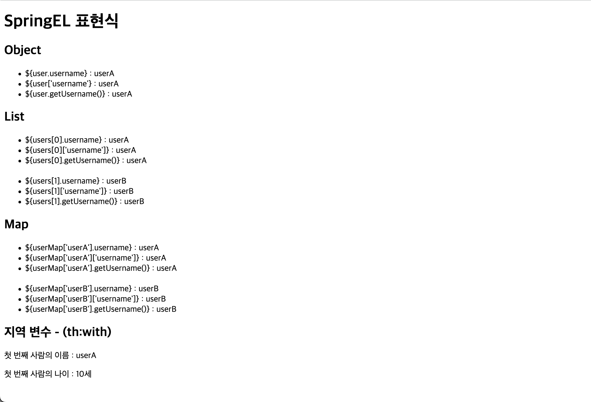

# thymeleaf
> Java Template Engine Library <br>
> [tymeleaf docs](https://www.thymeleaf.org/doc/tutorials/3.0/usingthymeleaf.html#introducing-thymeleaf)
***
<details>
<summary>(#01) Escape vs UnEscaped</summary>
<div markdown="1">

## (#01) Escape vs UnEscaped
HTML 문서는 ``<``, ``>`` 같은 특수문자를 기반으로 정의된다.
따라서 뷰 템플릿으로 HTML 화면을 생성할 때는 출력하는 데이터에 이러한 특수 문자가 있는 것을 주의해서 사용해야 한다.

* 변경 전 : Hello Spring!

```java
model.addAttribute("data", "Hello Spring!");
```

* 변경 후 : Hello ``<b>``Spring!``</b>``

```java
model.addAttribute("data", "<b>Hello Spring!</b>");
```

Escape 문법 때문에 ``<b>`` 태그가 적용되지 않는 모습이다. 따라서 타임리프에서 ``<b>`` 태그를
적용시키려면 아래의 2가지 기능을 사용해야 한다.

* ``th:text`` -> ``th:utext``
* ``[[${data}]]`` -> ``[(${data)]``

### 적용
```html
<!DOCTYPE html>
<html lang="en">
<head>
    <meta charset="UTF-8">
    <title>Title</title>
</head>
<body>
<ul>
    <li>th:text = <span th:text = "${data}"></span></li>
    <li>th:text = <span th:utext = "${data}"></span></li>
</ul>

<h1><span th:inline="none">[[...]] vs [(...)]</span></h1>
<ul>
    <li><span th:inline = "none"></span>[[${data}]]</li>
    <li><span th:inline = "none"></span>[(${data})]</li>
</ul>
</body>
</html>
```
### 결과

***

</div>
</details>

***

<details>
<summary>(#02) Variable - SpringEL</summary>
<div markdown="1">

## (#02) Variable - SpringEL
타임리프에서 변수를 사용할 때는 ``변수 표현식``을 사용한다.
> 변수 표현식 : ``${...}``

그리고 이 변수 표현식에는 ``스프링 EL``이라는 스프링이 제공하는 표현식을 사용할 수 있다.

### Controller에 User 객체 생성
```java
@GetMapping("/variable")
    public String variable(Model model){
        User userA = new User("userA", 10);
        User userB = new User("userB", 20);

        List<User> arr = new ArrayList<>();
        arr.add(userA);
        arr.add(userB);

        Map<String, User> map = new HashMap<>();
        map.put("userA", userA);
        map.put("userB", userB);

        model.addAttribute("user", userA);
        model.addAttribute("users", arr);
        model.addAttribute("userMap", map);

        return "basic/variable";
    }

    @Data
    static class User {
        private String username;
        private int age;

        public User(String username, int age) {
            this.username = username;
            this.age = age;
        }
    }
```

### variable.html
```html
<!DOCTYPE html>
<html lang="en">
<head>
    <meta charset="UTF-8">
    <title>Variable</title>
</head>
<body>
<h1>SpringEL 표현식</h1>

<h2>Object</h2>
<ul>
    <li>${user.username} : <span th:text = "${user.username}"></span></li>
    <li>${user['username'} : <span th:text = "${user['username']}"></span></li>
    <li>${user.getUsername()} : <span th:text = "${user.getUsername()}"></span></li>
</ul>

<h2>List</h2>
<ul>
    <li>${users[0].username} : <span th:text="${users[0].username}"></span></li>
    <li>${users[0]['username']} : <span th:text="${users[0]['username']}"></span></li>
    <li>${users[0].getUsername()} : <span th:text="${users[0].getUsername()}"></span></li>
<br>
    <li>${users[1].username} : <span th:text="${users[1].username}"></span></li>
    <li>${users[1]['username']} : <span th:text="${users[1]['username']}"></span></li>
    <li>${users[1].getUsername()} : <span th:text="${users[1].getUsername()}"></span></li>
</ul>

<h2>Map</h2>
<ul>
    <li>${userMap['userA'].username} : <span th:text = "${userMap['userA'].username}"></span></li>
    <li>${userMap['userA']['username']} : <span th:text = "${userMap['userA']['username']}"></span></li>
    <li>${userMap['userA'].getUsername()} : <span th:text = "${userMap['userA'].getUsername()}"></span></li>

    <br>

    <li>${userMap['userB'].username} : <span th:text = "${userMap['userB'].username}"></span></li>
    <li>${userMap['userB']['username']} : <span th:text = "${userMap['userB']['username']}"></span></li>
    <li>${userMap['userB'].getUsername()} : <span th:text = "${userMap['userB'].getUsername()}"></span></li>

</ul>

<h2> 지역 변수 - (th:with)</h2>
<div th:with="first=${users[0]}">
    <p>첫 번째 사람의 이름 : <span th:text = "${first.username}"></span></p>
    <p>첫 번째 사람의 나이 : <span th:text = "${first.age}"></span>세</p>
</div>

</body>
</html>
```
* `list`는 ``index``( [0], [1] .. )에 접근하여 변수를 사용할 수 있다.
* `map`은 `key`와 `value`로 이루어져 있기 때문에 `key`로 접근해야 한다.
* `username`, `['username']`, `getUsername()`은 모두 같다.
* `지역 변수`는 **선언한 태그 내에서만** 사용 가능하다.

### 결과


</div>
</details>

***

<details>
<summary>(#03) LocalDateTime</summary>
<div markdown="1">

## (#03) LocalDateTime
### BasicController에 date 메서드 추가
```java
    @GetMapping("/date")
    public String date(Model model){
        model.addAttribute("localDateTime", LocalDateTime.now());
        return "basic/date";
    }
```

### date.html
```html
<!DOCTYPE html>
<html xmlns:th="http://www.thymeleaf.org">
<head>
  <meta charset="UTF-8">
  <title>Title</title>
</head>
<body>
<h1>LocalDateTime</h1>
<ul>
  <li>default = <span th:text="${localDateTime}"></span></li>
  <li><b>포맷팅</b> : yyyy-MM-dd HH:mm:ss = <span th:text="${#temporals.format(localDateTime, 'yyyy-MM-dd HH:mm:ss')}"></span></li>

</ul>
<h1>LocalDateTime - Utils</h1>

<ul>
  <li>${#temporals.day(localDateTime)} = <span th:text="${#temporals.day(localDateTime)}"></span></li>
  <li>${#temporals.month(localDateTime)} = <span th:text="${#temporals.month(localDateTime)}"></span></li>
  <li>${#temporals.monthName(localDateTime)} = <span th:text="${#temporals.monthName(localDateTime)}"></span></li>
  <li>${#temporals.monthNameShort(localDateTime)} = <span th:text="${#temporals.monthNameShort(localDateTime)}"></span></li>
  <li>${#temporals.year(localDateTime)} = <span th:text="${#temporals.year(localDateTime)}"></span></li>
  <li>${#temporals.dayOfWeek(localDateTime)} = <span th:text="${#temporals.dayOfWeek(localDateTime)}"></span></li>
  <li>${#temporals.dayOfWeekName(localDateTime)} = <span th:text="${#temporals.dayOfWeekName(localDateTime)}"></span></li>
  <li>${#temporals.dayOfWeekNameShort(localDateTime)} = <span th:text="${#temporals.dayOfWeekNameShort(localDateTime)}"></span></li>
  <li>${#temporals.hour(localDateTime)} = <span th:text="${#temporals.hour(localDateTime)}"></span></li>
  <li>${#temporals.minute(localDateTime)} = <span th:text="${#temporals.minute(localDateTime)}"></span></li>
  <li>${#temporals.second(localDateTime)} = <span th:text="${#temporals.second(localDateTime)}"></span></li>
  <li>${#temporals.nanosecond(localDateTime)} = <span th:text="${#temporals.nanosecond(localDateTime)}"></span></li>
</ul>
</body>
</html>
```
날짜를 `formating` 할 수 있는 `#temporals.format()`을 자주 사용함

### 결과

</div>
</details>

***

<details>
<summary>(#04) URL 링크</summary>
<div markdown="1">

타임리프에서 URL을 생성할 때는 `@{...}` 문법을 사용하면 된다.

## BasicController에 link 메서드 추가
```java
    @GetMapping("/link")
    public String link(Model model){
        model.addAttribute("param1", "data1");
        model.addAttribute("param2", "data2");
        return "basic/link";
    }
```

## link.html
```html
<!DOCTYPE html>
<html lang="en">
<head>
    <meta charset="UTF-8">
    <title>URL Link</title>
</head>
<body>
<ul>
<li><a th:href="@{/hello}">basic url</a></li>
<li><a th:href="@{/hello(param=${param1}, param2=${param2})}">query param</a></li>
<li><a th:href="@{/hello/{param1}/{param2}(param1=${param1}, param2=${param2})}">path variable</a></li>
<li><a th:href="@{/hello/{param1}(param1=${param1}, param2=${param2})}"> query param + path variable </a></li>
</ul>
</body>
</html>
```

***

#### 단순한 URL
> `@{/hello}` : `/hello`
***
#### 쿼리 파라미터
> `@{/hello(param1=${param1}, param2=${param2})}` : `/hello?param1=data1&param2=data2`

`()` 에 있는 부분은 쿼리 파라미터로 처리된다.
***
#### 경로 변수
> `@{/hello/{param1}/{param2}(param1=${param1}, param2=${param2})}` : `/hello/data1/data2`
***
* 상대경로, 절대경로, 프로토콜 기준을 표현할 수 도 있다.

* `/hello` : 절대경로
* `hello` : 상대경로
</div>
</details>

***

<details>
<summary>(#04) Literal</summary>
<div markdown="1">

`리터럴`은 소스 코드상에 `고정된 값`을 말하는 용어이다.
예를 들어서 다음 코드에서 "Hello" 는 문자 리터럴, 10 , 20 는 숫자 리터럴이다.
```java
String a = "Hello";
int a = 10 * 20;
```

타임리프에서 문자 리터럴은 항상 `' (작은 따옴표)`로 감싸야 한다.
```html
<span th:text="'hello'">
```

### BasicController에 literal 메서드 추가
```java
@GetMapping("/literal")
    public String literal(Model model){
        model.addAttribute("data", "Spring!");
        return "basic/literal";
    }
```

### literal.html
```html
<!DOCTYPE html>
<html lang="en">
<head>
    <meta charset="UTF-8">
    <title>Literal</title>
</head>
<body>
<ul>
    <li>'hello' + ' world!' = <span th:text = "'hello' + ' world!'"></span></li>
    <li>'hello world!' = <span th:text="'hello world!'"></span></li>
    <li>'hello ' + ${data} = <span th:text="'hello ' + ${data}"></span></li>
    <li>리터럴 대체 |hello ${data}| = <span th:text="|hello ${data}|"></span></li>
</ul>
</body>
</html>
```

### 결과

</div>
</details>

***

<details>
<summary>(#05) Operation - 연산</summary>
<div markdown="1">

타임리프 연산은 자바와 크게 다르지 않다. 
HTML 안에서 사용하기 때문에 HTML 엔티티를 사용하는 부분만 주의하자.

## BasicController 추가
```java
    @GetMapping("/operation")
    public String operation(Model model){
        model.addAttribute("nullData", null);
        model.addAttribute("data", "타임리프 제대로 배우기");
        return "basic/operation";
    }
```

## operation.html
```html
<!DOCTYPE html>
<html lang="en">
<head>
    <meta charset="UTF-8">
    <title>Operation</title>
</head>
<body>

<ul>
  <li>산술 연산
    <ul>
      <li>10 + 2 = <span th:text="10 + 2"></span></li>
      <li>10 % 2 == 0 = <span th:text="10 % 2 == 0"></span></li>
    </ul>
  </li>
    <li> 비교 연산
        <ul>
            <li>1 > 10 = <span th:text="1 &gt; 10"></span></li>
            <li>1 gt 10 = <span th:text="1 gt 10"></span></li>
            <li>1 >= 10 = <span th:text="1 >= 10"></span></li>
            <li>1 ge 10 = <span th:text="1 ge 10"></span></li>
            <li>1 == 10 = <span th:text="1 == 10"></span></li>
            <li>1 != 10 = <span th:text="1 != 10"></span></li>
        </ul>
    </li>
    <li>조건식
        <ul>
            <li>(10 % 2 == 0) ? '짝수' : '홀수' = <span th:text="(10 % 2 == 0) ? '짝수' : '홀수'"></span></li>
        </ul>
    </li>
    <li>Elvis 연산자
        <ul>
            <li>${data} ? : '데이터가 없습니다.' = <span th:text="${data} ?: '데이터가 없습니다.'"></span></li>
            <li>${nullData} ? : '데이터가 없습니다.' = <span th:text="${nullData} ?: '데이터가 없습니다.'"></span></li>
        </ul>
    </li>
    <li>No Operation
        <ul>
            <li>${data} ?: _ = <span th:text="${data} ?: _">데이터가 없습니다.</span></li>
            <li>${nullData} ?: _ = <span th:text="${nullData} ?: _">데이터가 없습니다.</span></li>
        </ul>
    </li>
</ul>
</body>
</html>
```

## 결과

</div>
</details>

***

<details>
<summary>(#06) Attribute </summary>
<div markdown="1">

타임리프는 주로 HTML 태그에 `th:*` 속성을 지정하는 방식으로 동작한다. `th:*` 로 속성을 적용하면 기존
속성을 대체한다. 기존 속성이 없으면 새로 만든다.

## BasicController 추가
```java
    @GetMapping("/attribute")
    public String attribute() {
        return "basic/attribute";
    }
```

## attribute.html
```html
<!DOCTYPE html>
<html lang="en">
<head>
    <meta charset="UTF-8">
    <title>Attribute</title>
</head>
<body>

<h1>속성 설정</h1>
<input type="text" name="mock" th:name="userA"/>

<h1>속성 추가</h1>
- th:attrappend : <input type="text" class="text" th:attrappend="class =' large'"/><br>
- th:attrprepend : <input type="text" class="text" th:attrprepend="class ='large '"/><br>
- th:classappend : <input type="text" class="text" th:classappend="large"/><br>

<h1>checked 처리</h1>
- checked o <input type="checkbox" name="active" th:checked="true" /><br>
- checked x <input type="checkbox" name="active" th:checked="false" /><br>
- checked = false <input type="checkbox" name="active" th:checked="true" /><br>
</body>
</html>
```
***

속성 설정
th:* 속성을 지정하면 타임리프는 기존 속성을 th:* 로 지정한 속성으로 대체한다. 기존 속성이 없다면 새로 만든다.

```html
<input type="text" name="mock" th:name="userA" />
```

타임리프 렌더링 후 
```html
<input type="text" name="userA" />
```

***

#### 속성 추가
* `th:attrappend` : 속성 값의 `뒤에` 값을 추가한다. 
* `th:attrprepend` : 속성 값의 `앞에` 값을 추가한다. 
* `th:classappend` : `class` 속성에 자연스럽게 추가한다.

***

#### checked 처리
`HTML`에서는 `checked` 속성이 있기 때문에 `checked` 처리가 되어버린다.
```html
<input type="checkbox" name="active" checked="false" />
```
이 경우에도
`HTML`에서 `checked` 속성은 `checked` 속성의 값과 상관없이 
`checked` 라는 속성만 있어도 체크가 된다. 
이런 부분이 `true` , `false` 값을 주로 사용하는 개발자 입장에서는 불편하다.

타임리프의 `th:checked` 는 값이 `false` 인 경우 `checked` 
속성 자체를 `제거`한다. 

```html
<input type="checkbox" name="active" th:checked="false" />
```

타임리프 렌더링 후
```html
<input type="checkbox" name="active" />
```

## 결과

</div>
</details>

***

<details>
<summary>(#07) Each - 반복</summary>
<div markdown="1">

타임리프에서 반복은 `th:each` 를 사용한다. 
추가로 반복에서 사용할 수 있는 여러 상태 값을 지원한다.

## BasicController 추가
```java
   @GetMapping("/each")
  public String each(Model model) {
      addUsers(model);
      return "basic/each";
  }
  private void addUsers(Model model) {
      List<User> list = new ArrayList<>();
      list.add(new User("userA", 10));
      list.add(new User("userB", 20));
      list.add(new User("userC", 30));
      model.addAttribute("users", list);
  }
```

## each.html
```html
<!DOCTYPE html>
<html xmlns:th="http://www.thymeleaf.org">
<head>
    <meta charset="UTF-8">
    <title>Each</title>
</head>
<body>

<span th:each="user : ${users}">
    <span th:text="${user.username}"></span>
    <span th:text="${user.age}"></span>
    <br>
</span>

<h1>기본 테이블</h1>

<table border="1">
    <tr>
        <th>username</th>
        <th>age</th>
    </tr>
    <tr th:each="user : ${users}">
        <td th:text="${user.username}">username</td>
        <td th:text="${user.age}">0</td>
    </tr>
</table>

<h1>반복 상태 유지</h1>
<table border="1">
    <tr>
        <th>count</th>
        <th>username</th>
        <th>age</th>
        <th>etc</th>
    </tr>
    <tr th:each="user, userStat : ${users}">
        <td th:text="${userStat.count}">username</td>
        <td th:text="${user.username}">username</td>
        <td th:text="${user.age}">0</td>
        <td>
            index = <span th:text="${userStat.index}"></span>
            count = <span th:text="${userStat.count}"></span>
            size = <span th:text="${userStat.size}"></span>
            even? = <span th:text="${userStat.even}"></span>
            odd? = <span th:text="${userStat.odd}"></span>
            first? = <span th:text="${userStat.first}"></span>
            last? = <span th:text="${userStat.last}"></span>
            current = <span th:text="${userStat.current}"></span>
        </td>
    </tr>
</table>
</body>
</html>
```

반복 기능
```html
<tr th:each="user : ${users}">
```

반복시 오른쪽 컬렉션`${users}`의 값을 하나씩 꺼내서 왼쪽 변수
`user`에 담아서 태그를 반복 실행한다.

`th:each` 는 `List` 뿐만 아니라 `배열`,
`java.util.Iterable`, j`ava.util.Enumeration` 을 구현한 모든
객체를 반복에 사용할 수 있다. `Map` 도 사용할 수 있는데 이 경우 변수에 담기는 값은 `Map.Entry`다.


반복 상태 유지
```html
<tr th:each="user, userStat : ${users}">
```
반복의 `두번째 파라미터`를 설정해서 반복의 상태를 확인 할 수 있다.
`두번째 파라미터`는 `생략 가능`한데, 
생략하면 지정한 `변수명(user)` + `Stat`이 된다. 
여기서는 `user` + `Stat` = `userStat` 이므로 `생략` 가능하다.</div>

## 결과

</div>
</details>

***

<details>
<summary>(#08) 조건</summary>
<div markdown="1">

타임리프의 조건식
`if`, `unless`(if의 반대)

## BasicController 추가
```java
    @GetMapping("/condition")
    public String condition(Model model){
        addusers(model);
        return "basic/condition";
    }
```

***

## condition.html
```html
<!DOCTYPE html>
<html lang="en">
<head>
    <meta charset="UTF-8">
    <title>Condition</title>
</head>
<body>
<h1>if, unless</h1>
<table border="1">
    <tr>
        <th>count</th>
        <th>username</th>
        <th>age</th>
    </tr>
    <tr th:each="user, userStat : ${users}">
        <td th:text="${userStat.count}">1</td>
        <td th:text="${user.username}">username</td>
        <td>
            <span th:text="${user.age}">0</span>
            <span th:text="'미성년자'" th:if="${user.age lt 20}"></span>
            <span th:text="'미성년자'" th:unless="${user.age ge 20}"></span>
        </td> </tr>
</table>


<h1>switch</h1>
<table border="1">
    <tr>
        <th>count</th>
        <th>username</th>
        <th>age</th>
    </tr>
    <tr th:each="user, userStat : ${users}">
        <td th:text="${userStat.count}">1</td>
        <td th:text="${user.username}">username</td>
        <td th:switch="${user.age}">
            <span th:case="10">10살</span> <span th:case="20">20살</span> <span th:case="*">기타</span>
        </td> </tr>
</table>

</body>
</html>
```

### `if`, `unless`
타임리프는 해당 조건이 맞지 않으면 태그 자체를 렌더링하지 않는다.
만약 다음 조건이 `false` 인 경우` <span>...<span>` 부분 자체가 렌더링 되지 않고 사라진다. <span th:text="'미성년자'" th:if="${user.age lt 20}"></span>

### `switch`
* `*`은 만족하는 조건이 없을 때 사용하는 디폴트이다.
</div>
</details>

***

<details>
<summary>(#09) 주석</summary>
<div markdown="1">

## BasicController 추가
```java
    @GetMapping("/comments")
    public String comments(Model model){
        model.addAttribute("data", "Spring!");
        return "basic/comments";
    }
```

***

## condition.html
```html
<!DOCTYPE html>
<html lang="en">
<head>
    <meta charset="UTF-8">
    <title>Comments</title>
</head>
<body>

<h1>예시</h1>
<span th:text="${data}">html data</span>
<h1>1. 표준 HTML 주석</h1>
<!-- <span th:text="${data}">html data</span> -->

<h1>2. 타임리프 파서 주석</h1> <!--/* [[${data}]] */-->
<!--/*-->

<span th:text="${data}">html data</span>
<!--*/-->

<h1>3. 타임리프 프로토타입 주석</h1>
<!--/*/ <span th:text="${data}">html data</span> /*/-->

</body>
</html>
```
### 1. 표준 HTML 주석
   자바스크립트의 표준 HTML 주석은 타임리프가 렌더링 하지 않고, 그대로 남겨둔다.
### 2. 타임리프 파서 주석
   타임리프 파서 주석은 타임리프의 진짜 주석이다. 렌더링에서 주석 부분을 제거한다.

### 3. 타임리프 프로토타입 주석
   타임리프 프로토타입은 약간 특이한데, HTML 주석에 약간의 구문을 더했다.
   HTML 파일을 웹 브라우저에서 그대로 열어보면 HTML 주석이기 때문에 이 부분이 웹 브라우저가 렌더링하지 않는다.
   타임리프 렌더링을 거치면 이 부분이 정상 렌더링 된다.
</div>
</details>

***

<details>
<summary>(#10) 블록</summary>
<div markdown="1">

`th:block` 은 `HTML 태그`가 아닌 타임리프의 유일한 `자체 태그`다.

***

## BasicController 추가
```java
@GetMapping("/block")
  public String block(Model model) {
      addUsers(model);
      return "basic/block";
  }
```

***
## block.html
```html
<!DOCTYPE html>
<html lang="en">
<head>
    <meta charset="UTF-8">
    <title>Block</title>
</head>
<body>

<th:block th:each="user : ${users}">
    <div>
        사용자 이름 : <span th:text="${user.username}"></span><br>
        사용자 나이 : <span th:text="${user.age}"></span>
    </div>
    <div>
        요약 : <span th:text="${user.username} + ' / ' + ${user.age}"></span>
    </div>
    <br>
</th:block>
</body>
</html>
```

***

타임리프의 특성상 `HTML` 태그안에 속성으로 기능을 정의해서 사용하는데, 
위 예처럼 이렇게 사용하기 애매한 경우에 사용하면 된다. 
`th:block` 은 `렌더링시 제거`된다.

***

## 결과

</div>
</details>

***

<details>
<summary>(#11) 자바스크립트 인라인</summary>
<div markdown="1">

타임리프는 자바스크립트에서 타임리프를 편리하게 사용할 수 있는 `자바스크립트 인라인` 기능을 제공한다. 
`자바스크립트 인라인` 기능은 다음과 같이 적용하면 된다.

```html
<script th:inline="javascript">
```

***
## BasicController 추가
```java
@GetMapping("/javascript")
  public String javascript(Model model) {
      model.addAttribute("user", new User("userA", 10));
      addUsers(model);
      return "basic/javascript";
}
```
***

## javascript.html
```html
<!DOCTYPE html>
<html lang="en">
<head>
   <meta charset="UTF-8">
   <title>Javascript</title>
</head>
<body>
<!-- 자바스크립트 인라인 사용 전 -->
<script>
   var username = [[${user.username}]];
   var age = [[${user.age}]];

   //자바스크립트 내추럴 템플릿
   var username2 = /*[[${user.username}]]*/ "test username";

   //객체
   var user = [[${user}]];
</script>

<!-- 자바스크립트 인라인 사용 후-->
<script th:inline="javascript">
   var username = [[${user.username}]]
   var age = [[${user.age}]]

   // javascript natural template
   var username2 = "test username";

   // 객체
   var user = [[${user}]];
</script>
</body>
</html>
```

***

### 텍스트 렌더링
```javascript
var username = [[${user.username}]];
```
#### 인라인 사용 전 
```javascript
var username = userA;
```

#### 인라인 사용 후 
```javascript
var username = "userA";
```
***

인라인 사용 전 렌더링 결과를 보면 `userA` 라는 변수 이름이 그대로 남아있다.

타임리프 입장에서는 정확하게 렌더링 한 것이지만 아마 개발자가 기대한 것은 다음과 같은 `userA`라는 `문자`일 것이다.

결과적으로 `userA`가 변수명으로 사용되어서 자바스크립트 `오류`가 발생한다. 
다음으로 나오는 숫자 `age`의 경우에는 `"` 가 필요 없기 때문에 정상 렌더링 된다.

인라인 사용 후 렌더링 결과를 보면 문자타입인 경우 `"`를 포함해준다.

추가로 자바스크립트에서 문제가 될 수 있는 문자가 포함되어 있으면 `escape` 처리도 해준다. 
`예) " \"`

***

### Javascript natural template
타임리프는 HTML 파일을 직접 열어도 동작하는 `내추럴 템플릿` 기능을 제공한다.

`자바스크립트 인라인 기능`을 사용하면 `주석`을 활용해서 이 기능을 사용할 수 있다.

```javascript
var username2 = /*[[${user.username}]]*/ "test username"; 
```

#### 인라인 사용 전 
```javascript
var username2 = /*userA*/ "test username"; 
```

#### 인라인 사용 후 
```javascript
var username2 = "userA";
```
`인라인 사용 전` 결과를 보면 정말 순수하게 `그대로 해석`을 해버렸다.

따라서 `내추럴 템플릿` 기능이 동작하지 않고, 심지어 `렌더링 내용`이 `주석처리` 되어 버린다.

***

### 객체
타임리프의 자바스크립트 인라인 기능을 사용하면 객체를 `JSON`으로 자동으로 변환해준다.

* `var user = [[${user}]];`
  * 인라인 사용 전 : `var user = BasicController.User(username=userA, age=10);`;
  * 인라인 사용 후 : `var user = {"username":"userA","age":10};`
* 인라인 사용 전은 `객체`의 `toString()`이 `호출된 값`이다.
* 인라인 사용 후는 `객체`를 `JSON`으로 `변환`해준다.

***

</div>
</details>

***

<details>
<summary>(#12) 템플릿 조각 </summary>
<div markdown="1">

웹 페이지를 개발할 때는 `공통 영역`이 많이 있다. 
예를 들어서 `상단 영역`이나 `하단 영역`, 
`좌측 카테고리` 등등 여러 페이지에서 함께 사용하는 영역들이 있다. 

이런 부분을 코드를 `복사`해서 사용한다면 변경시 여러 페이지를 다 `수정`해야 하므로 
상당히 `비효율적`이다. 
타임리프는 이런 문제를 해결하기 위해 `템플릿 조각`과 `레이아웃 기능`을 지원한다.

***

## TemplateController 추가
```java
package Template.thymleaf.basic;

import org.springframework.stereotype.Controller;
import org.springframework.web.bind.annotation.GetMapping;
import org.springframework.web.bind.annotation.RequestMapping;

@Controller
@RequestMapping("/template")
public class TemplateController {

    @GetMapping("/fragment")
    public String template() {
        return "template/fragment/fragmentMain";
    }
}
```

***

## footer.html
```html
<!DOCTYPE html>
<html lang="en">
<head>
    <meta charset="UTF-8">
    <title>Footer</title>
</head>
<body>
<footer th:fragment="copy">
    푸터 자리 입니다.
</footer>

<footer th:fragment="copyParam (param1, param2)">
    <p>파라미터 자리 입니다.</p>
    <p th:text="${param1}"></p>
    <p th:text="${param2}"></p>
</footer>
</body>
</html>
```
***

## fragmentMain.html

```html
<!DOCTYPE html>
<html lang="en">
<head>
    <meta charset="UTF-8">
    <title>FragmentMain</title>
</head>
<body>
<h1>부분 포함</h1>
<h2>부분 포함 insert</h2>
<div th:insert="~{template/fragment/footer :: copy}"></div>

<h2>부분 포함 replace</h2>
<div th:replace="~{template/fragment/footer :: copy}"></div>

<h2>부분 포함 단순 표현식</h2>
<div th:replace="template/fragment/footer :: copy"></div>

<h1>파라미터 사용</h1>
<div th:replace="~{template/fragment/footer :: copyParam ('데이터1', '데이터 2')}"></div>
</body>
</html>
```

***

`template/fragment/footer :: copy` : `template/fragment/footer.html` 
템플릿에 있는 `th:fragment="copy"` 라는 부분을 `템플릿 조각`으로 가져와서 사용한다는 의미이다.

***

### 부분 포함 insert
```html
<div th:insert="~{template/fragment/footer :: copy}"></div>
```
`th:insert` 를 사용하면 `현재 태그(div)` 내부에 `추가`한다.

***

### 부분 포함 replace
```html
<div th:replace="~{template/fragment/footer :: copy}"></div>
```
`th:replace` 를 사용하면 `현재 태그(div)`를 `대체`한다.

***

### 부분 포함 단순 표현식
```html
<div th:replace="template/fragment/footer :: copy"></div>
```
`~{...}` 를 사용하는 것이 `원칙`이지만 `템플릿 조각`을 사용하는 
`코드가 단순하면` 이 부분을 `생략`할 수 있다.

***

### 파라미터 사용
다음과 같이 `파라미터를 전달`해서 `동적`으로 조각을 `렌더링` 할 수도 있다.

```html
 <div th:replace="~{template/fragment/footer :: copyParam ('데이터1', '데이터2')}"></div>
```
</div>
</details>

***

<details>
<summary>(#13) 템플릿 레이아웃 1 </summary>
<div markdown="1">

</div>
</details>

***

<details>
<summary>(#14) </summary>
<div markdown="1">

</div>
</details>

***

<details>
<summary>(#15) </summary>
<div markdown="1">

</div>
</details>